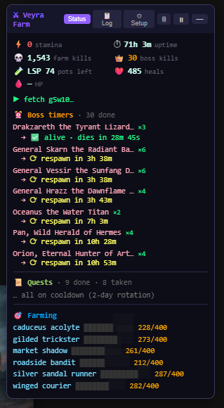
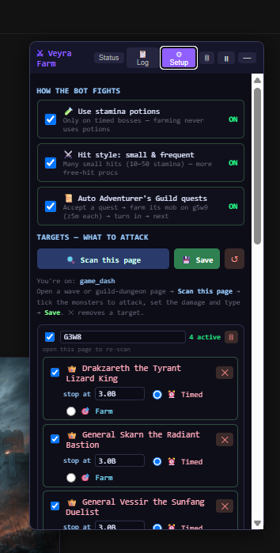

# Veyra Multi‑Farm Bot

A **Tampermonkey userscript** that adds a draggable control panel to the browser RPG on **demonicscans.org** and farms for you — hitting *exactly* the damage you ask for, so no stamina is wasted.

> ⚠️ **Use at your own risk.** Unofficial automation for a third‑party game; it may violate the game’s terms of service. Provided for educational purposes. **No credentials are stored** — the script just reads your existing login cookie in the browser at runtime.

> 💻 **Platform support:** currently working on **desktop / PC only**. **Mobile is still in testing** — phones suspend background JavaScript, so it isn't reliable yet. Use the PC version for now.

---

## Screenshots

| Status — live farming | Setup — pick your targets |
|---|---|
|  |  |

*Left: stamina, kills, boss respawn timers, quests and per‑mob farm bars. Right: toggle how the bot fights, “Scan this page”, and set each target’s stop‑at damage / mode.*

---

## What it does
- **Multi‑target farming** across several sources at once:
  - normal **wave mobs** (`active_wave.php`)
  - **timed bosses** — a priority pass fights them the moment they’re up
  - **guild‑dungeon bosses** (`battle.php?dgmid`)
  - **guild‑dungeon locations** (`guild_dungeon_location.php` — many instances, farmed by monster name)
  - **Adventurer’s Guild quests** — auto accept → farm the quest mob → turn in → next (respects the 2‑day rotation)
- **Exact‑damage hits** — composes 1 / 10 / 50‑stamina attack tiers to land within one small hit of your target (minimal overshoot), which also maximizes per‑hit proc chances.
- **Auto‑loot** every dead mob it’s responsible for, **auto‑heal** on death, and smart **stamina‑potion** use (only when truly out of stamina, and only the potions you allow).
- **“Scan this page”** — open any wave or dungeon page, scan it, tick the monsters to attack, set the damage and the mode (⏰ Timed / 🎯 Farm). Edits apply **live**.
- **Pause for manual play** — fully idle while paused (no requests), and the pause **survives page reloads**, so drinking a potion or fighting a boss by hand won’t restart the bot.
- **Mobile‑friendly** — responsive panel and a **screen wake‑lock** so it keeps running while the tab is open and in the foreground.

---

## Install (desktop)
1. Install [Tampermonkey](https://www.tampermonkey.net/).
2. Open the script’s **raw** URL → Tampermonkey shows the install page → **Install**.
3. Open demonicscans.org — the **⚔ Veyra Farm** panel appears bottom‑right.

## Install / update (mobile) — ⚠️ still in testing
**Mobile support is experimental and not reliable yet** — phones suspend background JavaScript, so the bot only runs with the **tab open and the screen on** (the built‑in wake‑lock keeps the screen awake). For now, prefer the **desktop / PC** version. If you want to try it anyway: install from the hosted raw URL once, and Tampermonkey will offer **one‑tap updates** whenever the version bumps — no copy‑paste needed. Use a Tampermonkey‑capable browser (Firefox, Kiwi, or Microsoft Edge on Android).

---

## Using it
- **Status** tab — stamina, uptime, kills, boss timers, quest progress, per‑mob farm bars.
- **Log** tab — full per‑hit trace (`copy(window.__farmLog())` in the console for the whole log).
- **⚙ Setup** tab — 🔍 *Scan this page* → tick targets, set **stop‑at damage** and **kills**, choose ⏰ Timed / 🎯 Farm. `💾 Save` applies everything (edits also auto‑apply as you type).
- **🗑** resets the top counters (keeps your farm progress) · **⏸ / ▶** pauses/resumes.

## Limitations
- The browser tab must stay **open and in the foreground**. Locking the phone or switching apps suspends it — a browser limitation, not fixable in a userscript.

---

*Single file: `farm_tampermonkey.user.js`. No build step, no dependencies.*
