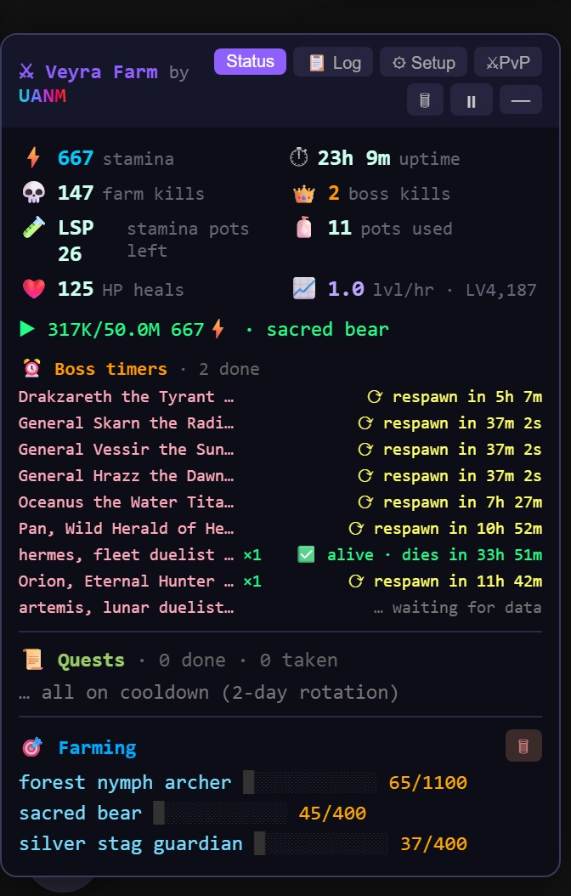
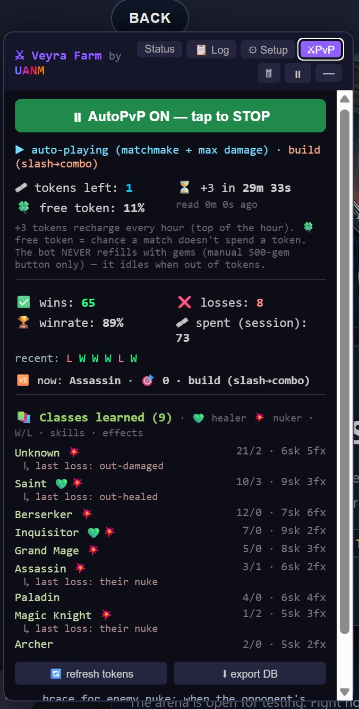
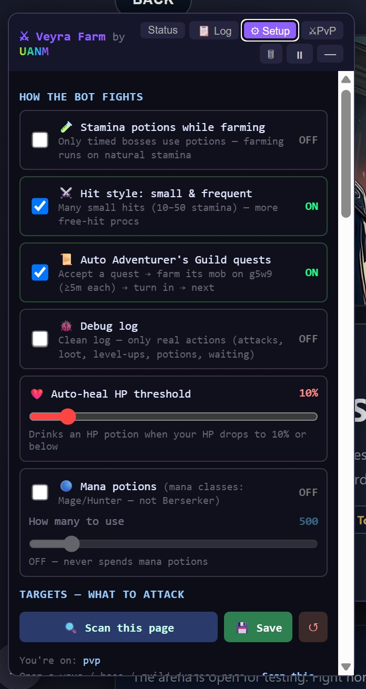
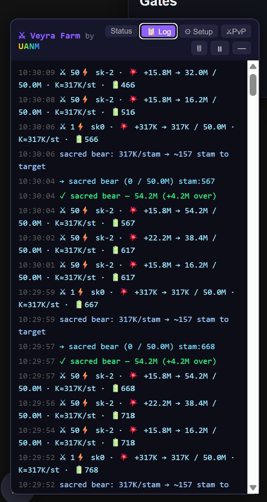
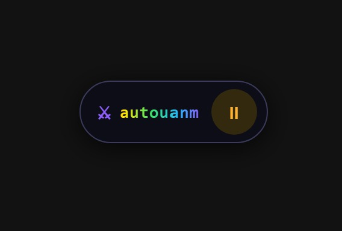

# Veyra Multi‑Farm Bot

A **Tampermonkey userscript** that adds a draggable control panel to the browser RPG on **demonicscans.org** and farms for you — hitting *exactly* the damage you ask for, so no stamina is wasted.

> ⚠️ **Use at your own risk.** Unofficial automation for a third‑party game; it may violate the game’s terms of service. Provided for educational purposes. **No credentials are stored** — the script just reads your existing login cookie in the browser at runtime.

> 📱 **Now works on mobile too.** The panel is fully responsive, with a thumb‑friendly bottom **dock** (tap to open / pause, drag anywhere) and a **screen wake‑lock** that keeps the tab alive. It runs while the tab is **open and in the foreground** — see [Mobile](#mobile) below.

---

## Screenshots

| Status — live farming | ⚔ Auto‑PvP |
|---|---|
|  |  |

| Setup — pick your targets | Log — per‑hit trace |
|---|---|
|  |  |

| Minimized dock (mobile‑friendly) | |
|---|---|
|  | |

*Top‑left: stamina, kills, lvl/hour, boss respawn timers, quests and per‑mob farm bars. Top‑right: Auto‑PvP — win‑rate, tokens, the per‑class skills it has learned. Bottom: “Scan this page” and each target’s stop‑at damage / mode, the live per‑hit log, and the collapsed dock (tap the logo to open, tap ⏸/▶ to pause, drag it anywhere).*

> 🆕 **Clean install.** The script ships with **no targets and no learned data** — every download starts blank. You pick your own bosses/farm mobs and the Auto‑PvP brain learns *your* enemies from scratch. Nothing of anyone else’s setup comes with it.

---

## What it does
- **Multi‑target farming** across several sources at once:
  - normal **wave mobs** (`active_wave.php`)
  - **timed bosses** — a priority pass fights them the moment they’re up
  - **guild‑dungeon bosses** (`battle.php?dgmid`)
  - **guild‑dungeon locations** (`guild_dungeon_location.php` — many instances, farmed by monster name). You can also scan the whole **instance overview** (`guild_dungeon_instance.php`) to add every zone at once, or a **cube dungeon** (`guild_dungeon_cube.php`) — it probes the instance and adds each PvE section + boss room.
  - **Adventurer’s Guild quests** — auto accept → farm the quest mob → turn in → next (respects the 2‑day rotation)
- **⚔ Auto‑PvP** (solo ladder) — toggle it on and the bot self‑matchmakes, plays each turn data‑driven from a per‑enemy‑class DB it **learns** every match (including empowered full‑resource skills), runs a lethal check and a survival brace, and adapts (e.g. races fast/“out‑damaging” classes like Assassins instead of slow‑building). **Works with any class — or none.** It reads your own kit at runtime: it fires your ultimate when your resource is full, otherwise plays your best affordable hit, and if you have no advanced class yet it just uses your basic attack. It starts knowing nothing and **learns as it fights**. *Note:* the most refined turn‑by‑turn tuning (token conservation + a low‑HP combo) is specific to the **Berserker’s Rage kit**, so a Berserker squeezes the most out of it; every other class still plays a solid generic game and improves as the DB fills.
- **Exact‑damage hits** — composes 1 / 10 / 50‑stamina attack tiers to land within one small hit of your target (minimal overshoot), which also maximizes per‑hit proc chances.
- **Per‑target “match name” filter** — attack only the right boss phase (e.g. fight *Hermes phase 3* by matching `ascended`), so multi‑phase fights aren’t started early.
- **Auto‑loot** every dead mob it’s responsible for, **auto‑heal** on death, and smart **stamina‑potion** use (only when truly out of stamina, and only the potions you allow — it spends **LSP** and never touches your **FSP** stash).
- **“Scan this page”** — open any wave or dungeon page, scan it, tick the monsters to attack, set the damage and the mode (⏰ Timed / 🎯 Farm). Targets are **grouped by type** (timed / dungeon / farm) and edits apply **live**.
- **Pause for manual play** — fully idle while paused (no requests), and the pause **survives page reloads**, so drinking a potion or fighting a boss by hand won’t restart the bot.
- **Mobile‑ready UI** — responsive panel, a draggable bottom **dock** with one‑tap open/pause (position persists), and a **screen wake‑lock** to keep the tab running while it’s open and in the foreground.

---

## Install (desktop)
1. Install [Tampermonkey](https://www.tampermonkey.net/).
2. Open the script’s **raw** URL → Tampermonkey shows the install page → **Install**.
3. Open demonicscans.org — the **⚔ Veyra Farm** panel appears bottom‑right.

## Mobile
Use a Tampermonkey‑capable browser — **Firefox**, **Kiwi**, or **Microsoft Edge** on Android:
1. Install Tampermonkey in that browser, then open the script’s hosted **raw** URL once to install it.
2. Open demonicscans.org — the panel appears. Tap the bottom **dock** to expand it, set your targets, and let it run.
3. Whenever the version bumps, Tampermonkey offers **one‑tap updates** straight from the hosted URL — no copy‑paste.

**How it behaves on a phone:** the panel is sized for small screens; the collapsed **dock** sits at the bottom so it’s easy to reach with a thumb (tap the logo to open, tap ⏸/▶ to pause, drag it anywhere and it remembers the spot). A **screen wake‑lock** keeps the screen awake so the tab isn’t suspended.

> ⚠️ **The one limit:** the tab has to stay **open and in the foreground**. If you lock the phone or switch to another app, the browser suspends background JavaScript and the bot pauses until you come back — that’s a browser restriction, not something a userscript can override. The wake‑lock keeps the screen on so it *keeps running* as long as that tab is the one you’re looking at.

---

## Using it
- **Status** tab — stamina, uptime, kills, lvl/hour, boss timers, quest progress, per‑mob farm bars.
- **Log** tab — full per‑hit trace (`copy(window.__farmLog())` in the console for the whole log).
- **⚙ Setup** tab — 🔍 *Scan this page* → tick targets, set **stop‑at damage** and **kills**, choose ⏰ Timed / 🎯 Farm, optional **match‑name** filter. Targets are grouped by type. `💾 Save` applies everything (edits also auto‑apply as you type).
- **Dock** — collapse the panel to the bottom dock; tap the logo to reopen, tap **⏸ / ▶** to pause/resume, drag it where you like.
- **🗑** resets the top counters (keeps your farm progress).

---

*Single file: `farm_tampermonkey.user.js`. No build step, no dependencies.*
